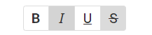

<!-- default badges list -->

<!-- default badges end -->
# DevExtreme ButtonGroup - Getting Started 

This repository stores the code examples of the ButtonGroup component for the [Getting Started with ButtonGroup](https://js.devexpress.com/Documentation/Guide/UI_Components/ButtonGroup/Getting_Started_with_ButtonGroup/) tutorial. The ButtonGroup is a set of toggle buttons that can be used as a mode switcher. This tutorial describes how to configure basic ButtonGroup features. 

## Files to Review

- **Angular**
    - [app.component.html](angular/src/app/app.component.html)
    - [app.component.ts](angular/src/app/app.component.ts)
- **jQuery**
    - [index.js](jquery/src/index.js)
- **React**
    - [App.js](react/src/App.js)
- **Vue**
    - [App.vue](vue/src/App.vue)
- **NetCore**    
    - [Index.cshtml](aspnetmvc/GettingStartedWithButtonGroup/Views/Home/Index.cshtml)
                    
## Documentation

- [Getting Started with ButtonGroup](https://js.devexpress.com/Documentation/Guide/UI_Components/ButtonGroup/Getting_Started_with_ButtonGroup/)

- [ButtonGroup - API Reference](https://js.devexpress.com/Documentation/ApiReference/UI_Components/dxButtonGroup/)
